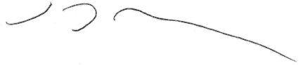

\captionsetup[table]{labelformat=empty}

```{r, echo=FALSE, message=FALSE, warning=FALSE}
load('project.group1.RData')
library(tidyverse)
library(gt23)
library(xtable)
library(RColorBrewer)
library(gridExtra)
library(knitr)
library(kableExtra)
```

\newpage

# Summary of results

The goal of this analysis is to investigate the integration profile of a gene therapy vector for the correction of cystinosis 
in both mouse and human subjects and assess potential clonal expansions. The list of human oncogenes used throughout 
this analysis was compiled from the literature ([link](http://www.bushmanlab.org/assets/doc/allOnco_Feb2017.tsv)) 
and the list of mouse oncogenes was compiled from the retroviral tagged cancer gene database (RTCGD)^1^ using an 
inclusion threshold of three or more incidents. The human oncogene list comprises `r humanGenomePercentOnco`% of 
all human genes (NCBI RefSeq) whereas the mouse oncogene list comprises `r mouseGenomePercentOnco`% of all mouse genes. 
The frequency of integration sites in human subjects near oncogenes was not significantly different than a published trial 
using a comparable vector to correct Wiskott-Aldrich syndrome (WAS) from which no adverse events have been reported^2^. 
The frequency of integration sites in bone marrow donor mice near oncogenes was generally less than that of mice in a previously 
published $\beta$-thalassemia mouse trial from which no adverse events have been reported ^3^. The integration position profile 
for human subjects was very similar to that found in the WAS trial. The mouse bone marrow transplant trials yielded varying degrees 
of persistence in five of the nine trials where detection was limited due to both sequencing depth and vector copy number. 
No significant enrichment of integration events near oncogenes was identified between donor and recipient mice. The code base 
for this analysis is available on-line ([link](https://github.com/everettJK/project.geneTherapy.ucsdMouseCystinosis)).

\vspace{0.1cm}

# Human and mouse samples studied

Integration sites were detected in `r length(unique(intSites$GTSP))` samples from both human and mouse subjects (Tables 1 & S1) 
while no integration sites were detected in `r length(samplesNoIntSitesFound)` of the provided samples (Table S2).

\vspace{0.1cm}

```{r, echo=FALSE, eval=TRUE}
names(summaryTable) <- c('Organism', 'Number of samples', 'Number of reads', 'Number of inferred cells', 'Number of integration sites')
kable(summaryTable,  format = "latex", align='c', caption = 'Table 1. Overview of data collection.', booktabs = T) %>%
  kable_styling(latex_options = c("hold_position"))
```

\vspace{0.1cm}

# Subject reports
Subject specific reports for all subjects are available via a protected web archive ([link](http://www.bushmanlab.org/data/export/cherqui)).  
user: cherqui  
pass: geneTherapy@!#  

\vspace{0.1cm}

# UCSC browser exploration
UCSC browser sessions pre-loaded with the integration sites identified in this analysis are available via these links: 
([human subjects](http://genome.ucsc.edu/cgi-bin/hgTracks?org=human&db=hg38&hgt.customText=http://microb120.med.upenn.edu/UCSC/cherqui/UCSC_CYS_human.group1.ucsc)), 
([mouse subjects](http://genome.ucsc.edu/cgi-bin/hgTracks?org=mouse&db=mm9&hgt.customText=http://microb120.med.upenn.edu/UCSC/cherqui/UCSC_CYS_mouse.group1.ucsc)). 
Integration sites are shown as blue (positive orientation integration) and red (reverse orientation integration) tick marks. For each integration site, 
a second track provides the maximum clonal abundance. Entering gene names into the search bar will direct the browser to specific genes. 

\newpage

# Description of analysis techniques  

We investigate effects of integration on cell growth using the following criteria:
Integration Frequency is the frequency at which unique integration sites are observed in or near a given gene.
Clonal Abundance is determined by quantifying the number of sites of linker ligation associated with each unique integration
site. This samples the number of DNA chains at the start of the experiment allowing clonal expansion to be quantified^4^.  

Relative clonal Abundance is determined per sample and is the percentage of identified cells attributed to a given clone.
Integration sites and the clones harboring them are sampled from a larger population. It would be rare for all integration
sites in a sample to be represented in the sequence data.  
  
For this analysis, four technical replicates of each delivered sample were prepared, sequenced and analyzed with the 
INSPIIRED integration site analysis pipeline (v1.2)^5^.

\newpage

# Comparisons to previous trials

## Integration events near oncogenes in human subjects

In order to determine if the experimental vector has a higher propensity of integrating near suspected oncogene in humans
than previously employed vectors, the frequency of integration near oncogenes was compared to a previously published human
trial^1^ which used a comparable lentiviral vector to correct Wiskott-Aldrich syndrome (WAS) where no adverse events have
been reported to date. The frequency of integration near oncogenes in four WAS pre-transplant patient samples was compared
to the frequency of integration in the experimental day 14 samples (Figure 1 [CYS: gray, WAS: blue]). The frequencies of integration near oncogenes of samples in this study and the previous WAS study were not significantly
different (Mann-Whitney U-test p-value: `r round(wilcox.test(humanSitesNearOnco$percentNearOnco, wasSitesNearOnco$percentNearOnco, correct = FALSE)$p.value, 3)`).

\vspace{0.1cm}

*Figure 1. Comparison of frequencies of integration events near oncogenes.*  
```{r fig1, echo = FALSE, fig.height=4}
WASvsHumanSubjects
```

\newpage

## Integration events near oncogenes in mouse subjects  

\vspace{0.1cm}

In order to determine if the experimental vector has a higher propensity of integrating near suspected oncogene in mice than
previously employed vectors, the frequency of integration near oncogenes was compared to a previously published mouse trial^3^ which used a comparable lentiviral vector to correct $\beta$-thalassemia. The frequency of integration events near onco genes 
in bone marrow donor mice was generally less than the mean frequency of integration events near oncogenes in the published trial (Figure 2 [CYS: gray, $\beta$-thalassemia trial: blue]).

*Figure 2. Comparison of frequencies of integration events near oncogenes.*  

```{r fig2, echo = FALSE, fig.height=4}
PMC3129560vsMouseSubjects
```

\newpage

# Mapping of integration site positions
Heat maps of identified integration sites are shown below in Figure 3a (human subjects) & 3b (mouse subjects). The integration
position profile from human subjects is very similar to the profile from the previous WAS study (Figure S2).

*Figure 3a*  


```{r fig3a, echo = FALSE, fig.height=6, dev='png', dpi=150, cache=FALSE}
humanIntSiteMap
```

\newpage

*Figure 3b.*  


```{r fig3b, echo = FALSE, fig.height=6, dev='png', dpi=150, cache=FALSE}
mouseIntSiteMap
```

\newpage

# Relative abundances of human subject samples

The sample relative abundance plots below (Figure 4) show the most abundant 25 clones in each human sample as colored 
bars while less abundant clones were relegated to a single low abundance bar shown in gray. Subject DON.002.4.SC 
showed an expanded clone (27% relative abundance) with an integration event down stream of the non-coding RNA gene LOC105374704. 
Subject pCYS.013.PS (PBCD34-MOI40) showed an expanded clone (27% relative abundance) with an integration event within intron 10 of ARFGEF1. 
These two expanded clones are not of immediate concern given that such expanded clones appeared in the WAS trial used 
for comparison (Figure S1) and both samples contained relatively few inferred cells which inflate relative abundance values. 

*Figure 4.*  

```{r fig4, echo=FALSE, eval=TRUE, fig.height=7, fig.width=8, cache=FALSE}
grid.arrange(grobs = humanRelAbundPlots[1:16], ncol = 4)
```

\newpage

*Figure 4. (continued)*  

```{r fig4cont, echo=FALSE, eval=TRUE, fig.height=7, fig.width=8, cache=FALSE}
grid.arrange(grobs = humanRelAbundPlots[17:length(humanRelAbundPlots)], ncol = 4)
```


\newpage


# Expanded clones  

Table 2 below lists clones with relative clonal abundances $\geq$ 20%. The estimated number of cells harboring each integration 
(Abundance) is shown for context. 

*Table 2.*  

```{r table2, echo=FALSE, eval=TRUE, cache=FALSE, results='asis'}
names(abundantClones20) <- c('Subject', 'Organism', 'Time point', 'Cell type', 'Position', 'Relative abundance', 'Abundance', 'Nearest Gene')
kable(abundantClones20, format = "latex", linesep = "", booktabs = T) %>% kable_styling(latex_options = c("striped", "scale_down"))
```

\newpage

# Mouse transplant trials  

The positions of identified integration sites from cell transplant trials with nine pairs of mice are shown in Figure 5a (donor
mice) and Figure 5b (recipient mice). The gRxCluster software package did not identify clusters of integration sites
between donor and recipient mice with a false discovery rate of $\leq$ 10%.
The relative clonal abundances of samples from the transplant trials are shown in Figure 6 where donor mice are shown on
the left and recipient mice are shown on the right. Integration sites are denoted by both nearest gene and genomic coordinate
and annotated with an asterisk (*) if located within transcription units and with a tilda (~) if the integration site is within 
50 KB of an oncogene. Below each abundance plot is a Fisher’s exact test for the enrichment of oncogenes. None of the tests returned
a significant result. The clonal abundances of clones found in both donor and recipient mice is shown in Table S3. The
identification of relatively few persistent clones is likely due to sequencing experiments sampling only a subset of existing
integration sites and a number of samples with low vector copy numbers (Figures 5B & S3).  

*Figure 5*  

```{r transplantSites, echo=FALSE, Figurewidth=11, fig.height=6, cache=FALSE}
grid.arrange(mouseDonorIntSiteMap + ggtitle('A'), mouseRecipientIntSiteMap + ggtitle('B'), ncol=2)
```

\newpage


```{r, echo=FALSE, fig.width=8, fig.height=7, results='asis', cache=FALSE}
n <- 1
for(i in 1:length(transferTrials)){
  cat(paste0('Figure 6', letters[n], '.\n\n'))
  n <- n+1
  print(transferTrials[[i]][[1]])
  cat('\n\\vspace{1.0cm}\n')
  caption <- paste0("Fisher's exact p-value: ", sprintf("%.3f", fisher.test(transferTrials[[i]][[2]])$p.value))
  print(kable(transferTrials[[i]][[2]], format = "latex", caption = caption, booktabs = TRUE) %>%  kable_styling(latex_options = c("hold_position")))
  cat('\n\\newpage\n')
}
```

\newpage

**Analyst**    
```{r echo=FALSE, Figurewidth=1}

```
   
John K. Everett, Ph.D.

\vspace{0.5cm}

**Laboratory director**    
```{r echo=FALSE, Figurewidth=1}

```
   
Frederic D. Bushman, Ph.D.

\vspace{2.0cm}

# References
  
1. RTCGD: retroviral tagged cancer gene database. Akagi K, Suzuki T, Stephens RM, Jenkins NA, Copeland NG. 
Nucleic Acids Res. 2004 Jan 1;32(Database issue):D523-7.

\vspace{0.1cm}

2. Outcomes following gene therapy in patients with severe Wiskott-Aldrich syndrome. Hacein-Bey Abina S, Gaspar HB, 
Blondeau J, Caccavelli L, Charrier S, Buckland K, Picard C, Six E, Himoudi N, Gilmour K, McNicol AM, Hara H, 
Xu-Bayford J, Rivat C, Touzot F, Mavilio F, Lim A, Treluyer JM, Héritier S, Lefrère F, Magalon J, Pengue-Koyi I, 
Honnet G, Blanche S, Sherman EA, Male F, Berry C, Malani N, Bushman FD, Fischer A, Thrasher AJ, Galy A, Cavazzana M. 
JAMA. 2015 Apr 21;313(15):1550-63.  

\vspace{0.1cm}

3. Distribution of Lentiviral Vector Integration Sites in Mice Following Therapeutic Gene Transfer to Treat $\beta$-thalassemia. 
Ronen K, Negre O, Roth S, Colomb C, Malani N, Denaro M, Brady T, Fusil F, Gillet-Legrand B, Hehir K, Beuzard Y, Leboulch P, Down JD, Payen E, Bushman FD. 
Mol Ther. 2011 Jul;19(7):1273-86.

\vspace{0.1cm}

4. Estimating abundances of retroviral insertion sites from DNA fragment length data. Berry CC, Gillet NA, Melamed A, Gormley N, Bangham CR, Bushman FD. 
Bioinformatics. 2012 Mar 15;28(6):755-62.

\vspace{0.1cm}

5. INSPIIRED: A Pipeline for Quantitative Analysis of Sites of New DNA Integration in Cellular Genomes. Sherman E, 
Nobles C, Berry CC, Six E, Wu Y, Dryga A, Malani N, Male F, Reddy S, Bailey A, Bittinger K, Everett JK, Caccavelli L, 
Drake MJ, Bates P, Hacein-Bey-Abina S, Cavazzana M, Bushman FD. Mol Ther Methods Clin Dev. 2016 Dec 18;4:39-49. 

\newpage

# Supplementary tables and figures

## Numbers of inferred cells and integration sites identified in provided samples

*Table S1.*  
```{r tableS1, echo=FALSE, eval=TRUE, cache=FALSE}
names(sampleSummary) <- c('Organism', 'GTSP', 'Subject', 'Cell type', 'VCN', 'Time point', 'Number inferred cells', 'Number of intSites')
kable(sampleSummary[1:30,], format = "latex", linesep = "", booktabs = T) %>% kable_styling(latex_options = c("striped", "scale_down"))
```

\newpage

*Table S1 (continued).*  
```{r tableS1c, echo=FALSE, eval=TRUE, cache=FALSE}
kable(sampleSummary[31:nrow(sampleSummary),], format = "latex", linesep = "", booktabs = T) %>% kable_styling(latex_options = c("striped", "scale_down"))
```

\newpage

## Analyzed samples in which no integration sites were identified  

*Table S2.*  
```{r tableS2, echo=FALSE, eval=TRUE, cache=FALSE}
names(failedSampleTable) <- c('GTSP', 'Cell type', 'Subject', 'Time point', 'Comment')
kable(failedSampleTable, format = "latex", linesep = "", booktabs = T) %>% kable_styling(latex_options = c("striped", "scale_down"))
```

\newpage

## Comparison of the number of integration sites and inferred cells  

Kolmogorov–Smirnov tests show no significant differences between the distributions of estimated abundances between trials. The plot below was truncated at 100 inferred cells for clarity which eliminated 16 data points from the ‘WAS m12’ distriubtion.  

*Figure S1.*   
  
```{r FigS1, echo=FALSE, eval=TRUE, fig.height=6, cache=FALSE, warning=FALSE}
intSiteFragPlot
```

\newpage

## Integration positions of the lentiviral theraputic vector from a previous WAS correction trial^1^  

*Figure S2.*   
  
```{r FigS2, echo=FALSE, eval=TRUE, fig.height=6, cache=FALSE}
WASintSites_d0_map
```

\newpage

## Persistence of clones in mouse BM transplant trials  

*Table S3.*   
  
```{r TableS3, echo=FALSE, eval=TRUE,  cache=FALSE}
names(cellTransfer_intSites_table) <- c('Donor', 'Recipient', 'Position', 'Donor cells', 'Recipient cells')
kable(cellTransfer_intSites_table[1:30,], format = "latex", linesep = "", booktabs = T) %>% kable_styling(latex_options = c("striped"))
```

\newpage

*Table S3. (continued)*   
  
```{r TableS3cnt, echo=FALSE, eval=TRUE,  cache=FALSE}
names(cellTransfer_intSites_table) <- c('Donor', 'Recipient', 'Position', 'Donor cells', 'Recipient cells')
kable(cellTransfer_intSites_table[31:nrow(cellTransfer_intSites_table),], format = "latex", linesep = "", booktabs = T) %>% kable_styling(latex_options = c("striped"))
```

\newpage

## Sequencing depth
Identified integration site are shown as colored squares that are positioned by the number of reads leading to their identification.  

*Figure S3.*   
  
```{r FigS3cont, echo=FALSE, eval=TRUE, fig.height=8, cache=FALSE, dev='png', dpi=150}
intSiteReadsPlot
```
